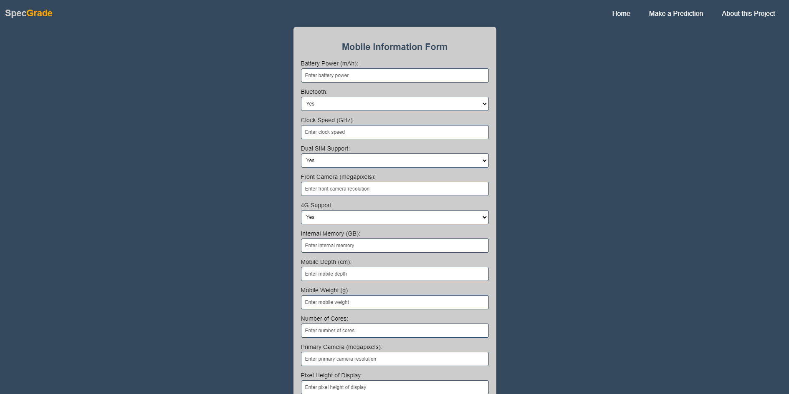
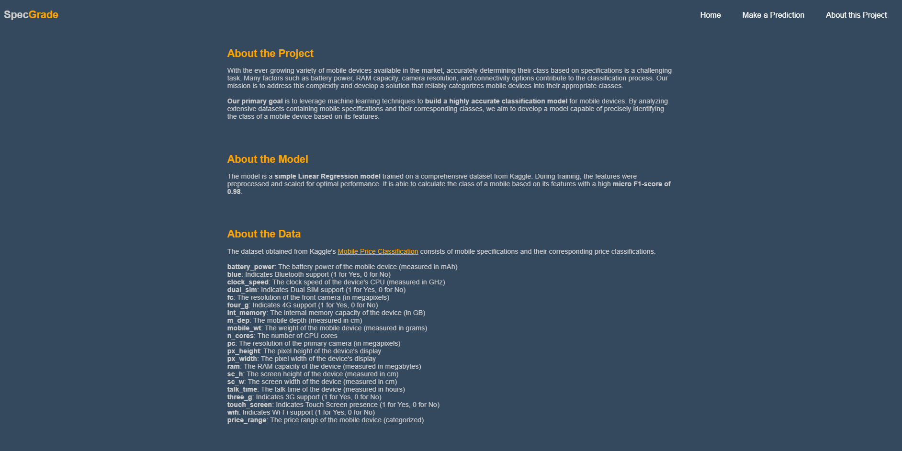

# Mobile Price Range Classification

An end-to-end project utilizing scikit-learn models, FastAPI, Docker, and GitHub Actions for CI/CD deployment on Azure.

---
## Contents

- [Project Overview](#project-overview)
- [Core Technologies](#core-technologies)
- [Get the Code and Set Up Locally](#get-the-code-and-set-up-locally)
- [Project Workflow](#project-workflow)
- [Web Application](#web-application)
- [Deploy and Run the Application with Docker](#deploy-and-run-the-application-with-docker)
- [Azure CI/CD Deployment with GitHub Actions](#azure-cicd-deployment-with-github-actions)
- [License](#license)
 
---
## Project Overview

This project aims to predict mobile price class based on their features using a sklearn model. The workflow involves the following steps:

1. **Data Collection**: Data is obtained from Kaggle's [Mobile Price Classification](https://www.kaggle.com/datasets/iabhishekofficial/mobile-price-classification) using the Kaggle API. This dataset includes various mobile phone spects such as battery power, number of cores, and RAM.
2. **Data Validation**: Ensuring the existence of the data.
3. **Data Preprocessing**: The collected data undergoes preprocessing to clean, transform, and prepare it for model training.
4. **Model Training**:  Various models are evaluated, and the best one is selected (based on micro f1 score). The model is trained to predict the price class of mobile phones based on their features.
5. **Model Evaluation**: The trained model undergoes evaluation on test data, and a file is retained containing metrics such as micro F1-Score, micro Precision, and micro Recall.
6. **Web Application**: A user-friendly web application is developed to allow users to input a mobile spects and receive real-time price classification.

By combining data collection, validation and preprocessing, model training and evaluation, and web development techniques, this project offers a comprehensive solution for mobile price classification that is easily accessible and usable by users.

To explore the detailed research and analysis conducted for the project, refer to the project's [Research Notebook](https://github.com/idalz/mobile-price-range-prediction/blob/main/research/00_idalz_research-notebook.ipynb).

---
## Core Technologies

- numpy
- pandas
- matplotlib
- seaborn
- scikit-learn
- xgboost
- catboost
- fastapi
- uvicorn
- Jinja2

---
## Get the Code and Set Up Locally

### Cloning the Repository and Setting Up Environment

To run the application on your local machine, follow these steps:

1. **Clone the Repository**:

Start by cloning the project repository from GitHub. Open your terminal and run the following command:

```bash
git clone https://github.com/idalz/mobile-price-range-prediction.git
```

2. **Set Up Kaggle API Key**

To access the dataset used in this project from Kaggle, you need to create a Kaggle API key. Follow the instructions [here](https://www.kaggle.com/docs/api) to create an API key.

3. **Create a Conda Environment**

Set up a Conda environment to isolate the project dependencies. Run the following commands in your terminal:

```bash
conda create -n <environment_name> python=3.8 -y
```

```bash 
conda activate <environment_name> 
```

\* Replace `<environment_name>` with the desired name for your Conda environment. 

4. **Install Requirements**

Install the project dependencies by executing the following command:

```bash
pip install -r requirements.txt
```

### Executing the Training Pipeline

To prepare the application for use, you'll need to execute the training pipeline. You can accomplish this by running the `main.py`:

```bash
python main.py
```

By following this step, you'll prepare the application for use and ensure that the model is trained and ready for predictions.

### Running the Application

To run the app, simply execute the following command in your terminal:
   
```bash
python app.py
```

This will start the Uvicorn server and run the web application. Once the application is up and running, you can open your web browser and navigate to `localhost:80` to access the application and try some predictions!

---
## Project Workflow

1. Update config.yaml
2. Update params.yaml
3. Update entity
4. Update configuration manager in src/config
5. Update the components
6. Update pipeline
7. Update main.py
8. Update app.py

---
## Web Application

The web application comprises three main pages:

#### Home Page

The home page serves as the primary interface for users and provides an overview of the application's functionality along with navigation options to access other pages.


*Figure 1: Home Page*

#### Form Page

The form page enables users to input various car features. Upon submission, the form triggers a POST request to the server to generate price predictions based on the provided features.


*Figure 2: Form Page*

#### About Page

The about page offers detailed information about the project, including its purpose, the underlying neural network model used for prediction, and a description of the dataset utilized for training the model.


*Figure 3: About Page*

These pages collectively provide users with an intuitive and interactive experience, facilitating easy exploration of the application's capabilities and insights into car price predictions.


---
## Deploy and Run the Application with Docker

1. **Download the Docker Image**:

Pull the Docker image from Docker Hub with the following command:
``` bash
docker pull idalz/mobile-price-range-prediction:latest
```

2. **Run a Docker Container**:

Launch a Docker container based on the downloaded image, specifying port mappings to expose port 80:

```bash
docker run -p 80:80 idalz/mobile-price-range-prediction:latest
```

Ensure the container is running by opening your browser and navigating to `localhost:80`. You can now use the application to make predictions!

---
## Azure CI/CD Deployment with GitHub Actions

### 01. Login to Azure Portal

### 02. Search for Container Registries

1. Create a new container registry.
2. Assign a resource group name.
3. Assign a registry name.
4. Assign a location.
5. Click on `preview+create` button.
6. Click on `create` button.

Now, a new container registry is ready!

### 03. Get the Access Keys

1. Click on `Go to resource` button.
2. In Access Keys store the login server.
3. Activate Admin user and store the password provided.

### 04. Create and Push the Image to Azure

Using your terminal follow these commands:

1. Build the docker image:

```bash
docker build -t <loginServer/appName:tag> .
```

2. Login to the server:

```bash
docker login <loginServer>
```

- Username: The app name that was given.
- Password: The stored password.

3. Push the image to Azure:

```bash
docker push <loginServer/appName:tag>
```

### 05. Search for Web App for Container

**Basics Tab**:
1. Select the resources group.
2. Give the name of the web app.
3. Select Linux as OS.
4. Set the region.

**Docker Tab**:
1. In options select Single Container
2. In image source select Azure Container Registry
3. Set Azure container registry as needed.

**Review+create Tab**:
1. Click on `create` button.

### 06. Setup the Web App 

1. Click on `resource` button.
2. Open `Deployment Center` Tab.
3. In source select Github Actions.
4. Set github actions as needed.
5. Set continuous deployment as On.

This will create a yaml file in your GitHub repository.

After building and deployment is completed in GitHub, the web app is ready for some predictions!

---
## License

This project is licensed under the [MIT License](LICENSE).
